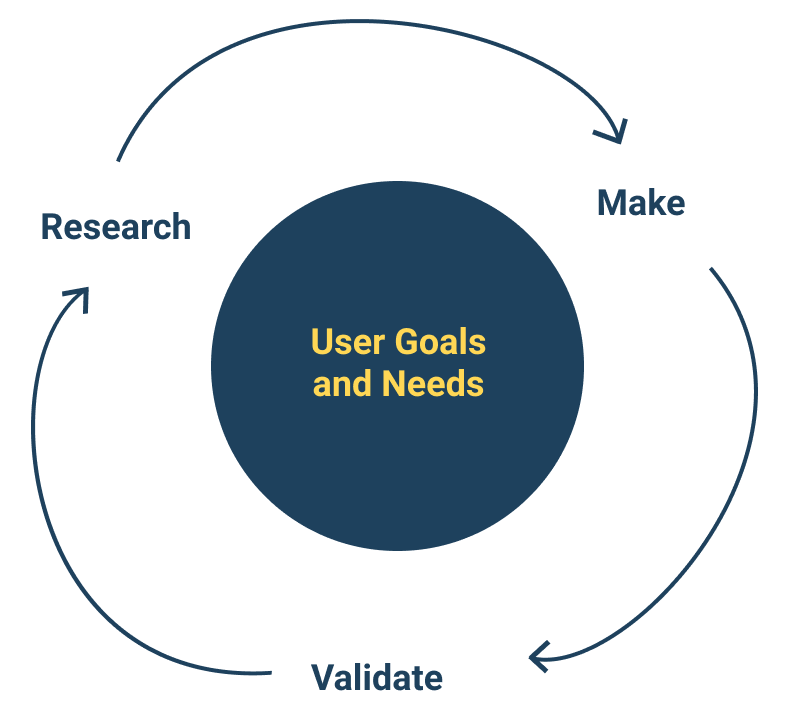
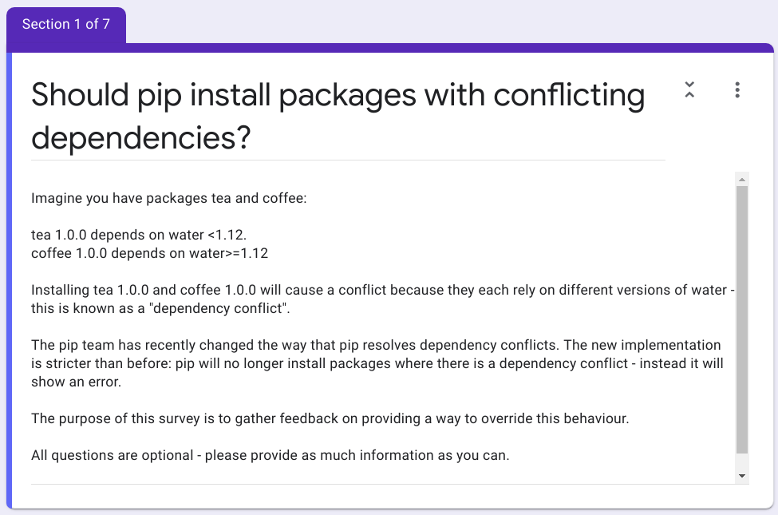
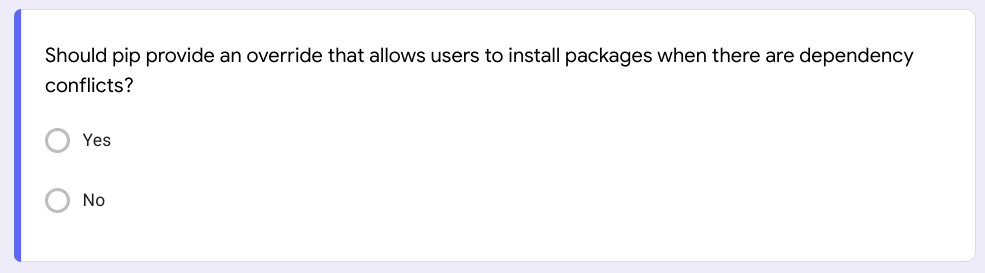
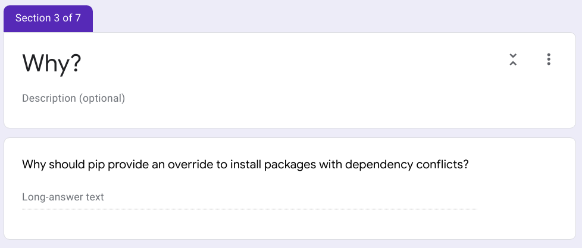
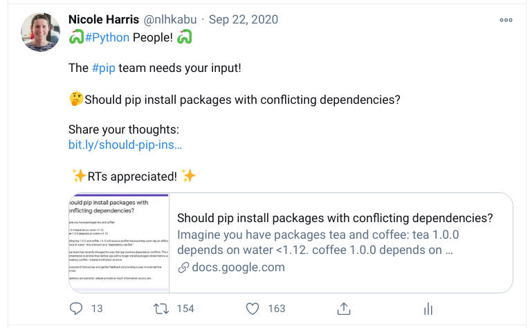

# **UX Research & Design**

Welcome to pip’s UX research and design documentation. The purpose of this section of the documentation is to:

* [Identify where new contributors can participate in or lead UX research and design activities](#bookmark=id.khffvuempn05)
* [Share pip UX research and design guidelines](#bookmark=id.aoozh7rloh72), including an introduction to User Centered Design practices, and how they can be applied to the pip project
* Share [results of user research](#bookmark=id.xvifypvbg4m0) that the pip team has already conducted

## **How to contribute**

### **Participate in UX research**

It is important that we hear from pip users so that we can:

* Understand how pip is currently used by the Python community
* Understand how pip users _need_ pip to behave
* Understand how pip users _would like_ pip to behave
* Understand pip’s strengths and shortcomings
* Make useful design recommendations for improving pip

If you are interested in participating in pip user research, please[ join pip’s user panel](https://mail.python.org/mailman3/lists/pip-ux-studies.python.org/). 

### **Test new features**

You can help the team by testing new features as they are released to the community.

**Report and work on UX issues**

If you believe that you have found a user experience bug in pip, or you have ideas for how pip could be made better for all users, please file an issue on the[ pip issue tracker](https://github.com/pypa/pip/issues/new).

You can also help improve pip’s user experience by[ working on UX issues](https://github.com/pypa/pip/issues?q=is%3Aissue+is%3Aopen+label%3A%22K%3A+UX%22). Issues that are ideal for new contributors are marked with “[good first issue](https://github.com/pypa/pip/issues?q=is%3Aopen+is%3Aissue+label%3A%22good+first+issue%22)”. Explore the [UX Guidance](#bookmark=id.aoozh7rloh72) in the docs if you have questions.

Currently, we are also looking for volunteers to move UX recommendations (see “[results of user research](#bookmark=id.xvifypvbg4m0)”) into the issue tracker - either by opening new issues, or by commenting on relevant existing issues.

## **Pip UX research and design guidelines**

This section of the documentation is intended for contributors who wish to work on improving pip’s user experience, including pip’s documentation.

### **What is user centered design?**

User-centered design (UCD) or human-centered design (HCD) is an iterative process in which  design decisions are informed by an understanding of users and their needs. There are many terms used to describe this type of work; in this document we will use “user experience (UX) research and design”.

For the pip project, UX research and design can be used to:

* Develop a deeper understanding of pip’s users, the context in which they use pip and the challenges that they face
* Inform the design of new or existing pip features, so that pip us more usable and accessible. This may include improving pip’s output (including error messages), controls (e.g. commands and flags) and documentation
* Help pip’s development team prioritize feature requests based on user needs

At a high level, the UX research and design process is comprised of:

1. **[Research](#bookmark=id.qm3ypdd24w41)**, where a variety of techniques are used (e.g. [surveys](#bookmark=id.ti756ptgpj2k) and [interviews](#bookmark=id.w2f6rkwokvnm)) to learn about users and what they want from the tools they use
2. **[Design](#bookmark=id.46ola19x5669)**, where solutions are proposed to response to the research conducted

UX research and design is conducted iteratively, with design proposals (e.g. [prototypes](#bookmark=id.51h7jqn002u0)) tested with users to validate that they are effective in meeting users’ needs. Often, it is necessary to complete several cycles of research, design and validation to find a solution that works:

_Alt Text: Graphic showing an iterative process of Research, Make (Design), Validate, around user goals and needs._

For more information on how this process has been applied to the pip project, see [research results](#bookmark=id.xvifypvbg4m0).

See also:

* [https://www.interaction-design.org/literature/topics/user-centered-design](https://www.interaction-design.org/literature/topics/user-centered-design)
* [https://www.usability.gov/what-and-why/user-centered-design.html](https://www.usability.gov/what-and-why/user-centered-design.html)
* [https://www.nngroup.com/topic/user-centered-design/](https://www.nngroup.com/topic/user-centered-design/)

#### Conducting research for pip

User research can be used to answer a few different types of questions:

* _Understanding the context generally_ — e.g. how is pip used by people? What different environments and contexts is pip used in?
* _Understanding the users more broadly_ — e.g. who uses pip? How much experience do they have typically? How do they learn how to use pip? Are there any common characteristics between pip users? How diverse are the needs of pip’s users? 
* _Evaluating a specific need or challenge_ — e.g. how are pip users encountering a given issue? When does it come up? Do pip users regularly encounter this issue? How would a new feature address this issue?

During the research process, it is important to engage users for input, and incorporate their feedback into decision making. 

Input and feedback from users is as valuable to an open source project as code contributions; end users may not be ready yet to submit a pull request or make fixes into the code directly, but their feedback can help to shape pip’s priorities and direction. 

There are many ways to engage users in open source projects, and sometimes input from community members can feel overwhelming! Providing a structure, such as surveys and interviews, can make it easier to collect and understand feedback. Some examples of how to engage users are:

* _Surveys_ — good for targeted feedback about specific issues and broad community context and understanding
* _Interviews_ — good for in-depth conversations to understand or explore a topic
* _Testing_ — good to evaluate an issue or validate a design idea
* _Open issue queues_ (e.g. Github issues) & Support ticket systems — great data source to understand common challenges
* _Forums or discussion tools_ — great data source to understand common challenges or engage broader community in open discussion
* _Conferences and events_ — great opportunity to go lightweight interviews or testing of specific features

When running [UX research on pip in 2020](#bookmark=id.mv9mqowb8565), we found that surveys and interviews were particularly useful tools to engage with pip’s users. Some general guidelines, as well as pip-specific recommendations are below.

##### Surveys

Surveys are great for collecting broad, large scale input, e.g. learning more about pip’s user community as a whole, or for getting targeted feedback about a specific issue. 

Surveys can also be leveraged to get in-situ feedback with early releases of new tools, e.g. prompting users on the command line if they are using a beta version of a feature or asking people for feedback on a documentation page.

As an example, in 2020, the pip UX team published several surveys to learn about pip and pip’s users. This included: 

* Understanding ‘who uses pip’
* Collecting feedback about pip’s documentation
* Collecting feedback about pip’s beta release of the 2020 dependency resolver
* Asking users how specific parts of pip’s 2020 dependency resolver should behave

A full list of the surveys published in 2020 and their results [can be found here](#bookmark=id.ti756ptgpj2k).

###### Designing surveys

When designing surveys, it is important to first establish what you want to learn. It can be useful to write this down as research questions. Example pip research questions [can be found here](https://github.com/pypa/pip/issues/8518).

If you find that your topic is large, or you have many research questions, consider publishing several separate surveys, as long surveys risk a low response / high dropoff rate.

Below is a brief guide to building a survey for pip:

1. **Introduce your survey \
**Explain the motivation for the survey, or (for surveys about pip’s behaviour) set the scene with a scenario.
2. **Design your questions**
    1. Limit the number of questions you ask to avoid a low response rate. A good rule of thumb is: 3-4 questions about the specific topic, 2-3 questions about users level of experience / what they use Python or pip for. \
When asking about years of experience use the following groupings as options:
        * &lt; 1 Year
        * 1-3 Years
        * 4-6 Years
        * 7-10 Years
        * 11-15 Years
        * 16+ Years
    2. Use **[closed questions](https://en.wikipedia.org/wiki/Closed-ended_question)** with a fixed number of possible responses (e.g. yes/no, multiple choice, checkboxes, or [likert scale](https://www.nngroup.com/articles/rating-scales)) for measuring behaviour, opinion or preferences
    3. Use **[open questions](https://en.wikipedia.org/wiki/Open-ended_question)** to learn about reasoning. If you are using a lot of closed questions in your survey, it is useful to include some open questions to “fish” for less expected answers - e.g. asking a user “why?” they chose a particular option 
3. **Pilot your survey and modify it based on feedback \
**This could be as simple as sharing it with 1-2 people to see if it makes sense.
4. **Determine where to do outreach  \
**Establish who you want to hear from and where you should post the survey. Are there community members or groups that can help you reach more people?
    4. Does the survey need to be translated into other languages to reach a broader set of the community?
    5. Are you able to compensate people for their time?
    6. Do participants want to be acknowledged as contributors?

    See [survey and interview outreach](#bookmark=id.bdn2zmwpynly) for recommendations on how to do outreach for pip based on the UX research conducted in 2020.

5. **Launch and promote your survey**

###### Survey case study

The process described above was followed in 2020, when we wanted to establish whether pip [should install packages with conflicting dependencies](https://github.com/pypa/pip/issues/8452).

First, we introduced the purpose of the survey, with a scenario:

==To-Do: add alt-text to this image==

Next, we asked a closed question to establish what the user prefers:

==To-Do: add alt-text to this image==

Following this, we qualified the response with an open question:

==To-Do: add alt-text to this image==

This was followed by further questions about workarounds, syntax and behaviour preferences.

Finally, we asked survey participants about themselves, including how much Python experience they have, and what they use Python for. This was to find out if different types of Python users answered the questions differently.

This survey was shared with the pip team and improved several times, before it was published and promoted using a variety of [outreach channels](#bookmark=id.bdn2zmwpynly).

In total, we received 415 responses, with [clear results](https://hackmd.io/MIRY9jpRSNyuzMXoWmSqIg) that helped us to make strong recommendations on how to move forward with this feature.

###### Analysing Survey Results

Surveys are particularly useful for being able to quickly understand trends from a larger population of responses. If your questions are designed well, then you should be able to easily aggregate the data and make statements such as: _`X% of respondents said that Option B was the best option._`

###### Contextualizing the responses

It’s important to remember that the responses to your survey will be biased by the way that you did outreach for your survey, so unless you can be sure that the people who responded to your survey are representative of all of your users, then you need to be sure to contextualize the results to the participants. Within your survey responses it can be helpful to see if there is variation in the responses by different aspects of your users or your user community, e.g.

* By experience level — Are responses consistent across experience level or do they vary? E.g. Do newer or more junior experience users have different responses, needs or challenges?
* By background/context — Are responses consistent across background or context? E.g. Do users in a corporate context have similar responses to hobbyist/independent users? Do data analysts have similar responses to software engineers?

###### How many responses is enough?

It depends! This is a hard question to answer in research like this — Traditional statistics would suggest that “enough” depends on the total population you need the survey to represent. In UX research, the answer tends to be more around when you see variation in responses level out, and so it’s more about signals and trends in the data.

If you are finding that there aren't patterns in the data, it might mean that your questions weren’t clear or provided too many options, or it might mean that you need to reach out to more people.

See also:

* [https://www.nngroup.com/articles/qualitative-surveys/](https://www.nngroup.com/articles/qualitative-surveys/)
* [https://www.nngroup.com/videos/open-vs-closed-questions/](https://www.nngroup.com/videos/open-vs-closed-questions/)
* [https://www.hotjar.com/blog/survey-questions/](https://www.hotjar.com/blog/survey-questions/)

#### Interviews

Interviews are a great way to have more in-depth conversations with users to better understand or explore a topic. Unlike surveys, they are not a great way to understand overall patterns, as it is hard to engage with a large number of people due to the time involved. It can be particularly useful to plan around conferences and events as a way to connect with many users in a more informal setting.

##### Designing Interviews for pip

As with surveys, it’s important to establish what you want to learn before you begin. 

Often, interviews are conducted with a script; this helps the interview run smoothly by providing some structure. However, it is also ok to go “off script” if the conversation is moving in an interesting or insightful direction.

Below is a brief guide to running an interview for pip:

1. Write your script 
This should include an introduction that sets the scene for the participant, explaining what the interview is about, how you (or observers) will take notes, how long it will take, how their feedback will be used (and shared) and any other pointers you want to share.

Next, design your questions. Limit the number of questions, so that you have enough time to cover key points and the interview does not run for too long. Like in surveys, a good rule of thumb is 2-3 questions about users' level of experience, and what they use Python/pip for, plus 3-4 questions about the specific topic.

There are [four different types of interview questions](https://simplysecure.org/resources/qualitative_interviewing.pdf):

    1. _Descriptive_ — This type of question gives you concrete, specific stories and details. It also helps your interviewee “arrive” at the interview, resurfacing their relevant experiences and memories. E.g.
        a. Tell me about a time…
        b. Tell me about the first time…
        c. Tell me about the last time…
        d. Tell me about the worst/best time…
        e. Walk me through how you…
        
    2. _Reflective_ — These questions allow the interviewee to revisit and think more deeply about their experiences. Helping the interviewee reflect is at the heart of your interview. Don’t rush – give them lots of space to put their thoughts together.
        6. What do you think about…
        7. How do you feel about…
        8. Why do you do…
        9. Why do you think…
        10. What effects did it have when…
        11. How has ... changed over time?
        
    3. _Clarifying_ — This type of question gives interviewees the opportunity to expand on key points. Skillful clarifying questions also let you subtly direct the interviewee’s storytelling towards the areas you find most intriguing and relevant.
        12. What do you mean when you say…
        13. So, in other words…
        14. It sounds like you’re saying [...]. Is that right?
        15. Can you tell me more about that?
        
    4. _Exploratory_ — These questions are an invitation to the interview-ee to think creatively about their situation, and are best left for the end of the interview. Careful, though – suggestions from a single person are rarely the answer to your design problem, and you need to be clear to them that you’re just collecting ideas at this point. 
        16. How would you change…
        17. What would happen if…
        18. If you had a magic wand...
2. **Pilot interview with 1-2 people & modify based on their feedback**
3. **Determine how to do outreach for interviews**
    a. Who do you want to be sure to hear from? Where do you need to post to contact people for interviews? Are there community members or groups that can help you reach specific people?
    b. Do the interviews need to be translated into other languages to reach a broader set of the community or a specific community?
    c. How will people sign up for your interview?
    d. Are you able to compensate people for their time?
    e. Do participants want to be acknowledged as contributors?

    See [survey and interview outreach](#bookmark=id.bdn2zmwpynly) for recommendations on how to do outreach for pip based on the UX research conducted in 2020.

4. **Start outreach!**

Here is an example user interview script used for speaking to users about pip’s documentation:

**Introduction**

* Firstly thank you for giving me your time and for your continued involvement.
* The purpose of this interview is to better understand how pip’s documentation is perceived and used by Python community members
* The interview will take approximately 30 minutes. If you don't understand any of the questions please ask me to repeat or rephrase. If you don't have a good answer, feel free to tell me to skip.
* I will be taking notes. These will be shared on GitHub or the pip docs, but we will remove any identifying data to protect your anonymity
* Please be honest - your feedback can help us make pip better. I won't be offended by anything you have to say :)
* (optional) Do you mind if I record this session?

**Opening questions**

* Can you tell me a bit about how you use Python?
* How long have you been using pip?

**Solving problems**

* Can you tell me about a time you had a problem when using pip?
    * What happened?
    * What did you do?
    * Where did you go?
    * How did you resolve your problem?
* Please go to[ https://pip.pypa.io/en/stable/](https://pip.pypa.io/en/stable/)
    * Have you ever used this documentation?
    * On a scale of 1-10 how useful was it?
    * Why?
* Are there any projects that you use that you'd like us to look at when thinking about improving pip's docs?
    * What makes that documentation good/useful?

**Conclusion**

* What one thing could the pip team do to help users troubleshoot pip problems?
* Do you have any questions?

##### How many interviews is enough?

This depends on the complexity of the issue you are discussing, and whether or not you feel that you have gained enough insight from the interviews you have conducted. It also depends on whether you feel you have heard from a wide enough range of people. For example, you may wish to stop interviewing only after you have heard from both expert _and_ novice pip users.

Often, conducting just a few interviews will uncover so many problems that there is enough material to make recommendations to the team.

##### Analyzing interview data

Formal interview analysis typically uses a process called “coding” where multiple researchers review interview transcripts and label different statements or comments based on a code system or typology that has been developed to align with the research. This is a great practice and a great way to make sure that the researchers’ bias is addressed as part of the process, but most teams do not have the staffing or resources to do this practice. 

Instead many smaller teams use lightweight processes of capturing interview statements into **themes**, e.g. specific topics or issue areas around needs or challenges. Interviews are also a great source for **quotes**, which can be helpful for providing an example of why something is important or when/how something comes up for users. 

Interview analysis is frequently done using sticky notes, where you can write a quote, issue or finding on a sticky note and then move the sticky notes around into clusters that can be labeled or categorized into the themes. Remotely this can be facilitated by any number of tools, e.g. digital sticky board tools like [Miro](https://miro.com/) or [Mural](https://www.mural.co/), or even kanban board tools like [Trello](https://trello.com/), [Wekan](https://wekan.github.io/) or [Cryptpad](https://cryptpad.fr/), or this can be done just with text documents or spreadsheets, using lists and categories. It can be helpful to use a [worksheet for debriefing](https://simplysecure.org/resources/interview_synthesis.pdf) at the end of each interview to capture insights and themes quickly before you forget topics from the specific interview.

See also:
* [https://www.nngroup.com/articles/user-interviews/](https://www.nngroup.com/articles/user-interviews/)
* [https://www.nngroup.com/articles/interviewing-users/](https://www.nngroup.com/articles/interviewing-users/)

### Survey and interview outreach

The following is a list of outreach platforms that the pip team used when conducting research in 2020. Some were more successful than others:

1. **Recommended:** UX Research Panel \
As part of the [2020 UX Work](#bookmark=id.mv9mqowb8565), we published a form that asked people to join a research panel and be regularly contacted about surveys and interview opportunities. This is now a [mailing list that users can sign up for](https://mail.python.org/mailman3/lists/pip-ux-studies.python.org/), and will be used in an ongoing way in addition to broad public outreach.
2. **Recommended:** Twitter \
We found Twitter to be a very effective platform for engaging with the Python community and drive participation in UX research. We recommend:
    1. Asking [ThePSF](https://twitter.com/ThePSF), [PyPA](https://twitter.com/ThePyPA) and [PyPI](https://twitter.com/pypi) to retweet calls for survey and interview participation
    2. Asking specific individuals (who have reach within specific communities, or general followings within the Python community) to retweet.
    3. Explicitly asking for retweets within tweets: 
	

==To-Do: add alt-text to this image==

4. Responding to users within Twitter

3. **Not recommended:** Forums (Discourse, etc)
    5. We used [discuss.python.org](https://discuss.python.org/) several times, posting to the [packaging forum](https://discuss.python.org/c/packaging/14) to ask packaging maintainers about their views on pip’s functionality. Unfortunately, this was not as fruitful as we hoped, with very few responses. We found that engaging with packaging maintainers via Twitter was more effective.
    6. Posting surveys on Reddit was also not as useful as we had expected. If the user posting the survey or call for research participation does not have significant credit on reddit, then the posting process itself can be challenging. Overall we did not see as much engagement in surveys or interviews come from Reddit relative to other outreach means.
4. **Recommended:** Specific Interest Groups
We engaged with the [PyLadies](https://pyladies.com/) community via their [Slack channel](https://slackin.pyladies.com/) to drive more participation from women using pip, as we found this demographic more difficult to reach via other channels
5. **Recommended:** Conference communities
Due to the 2020 Global Pandemic we were unable to engage with users via PyCon (or other regional conferences) as we would have liked. However, we would still recommend this channel as a fast and insightful way to engage with large groups of interested people.
6. **Worth Exploring:** Adding a prompt/path into the ‘help’ command in the command line tool.  \
We didn’t have a chance to explore this opportunity, but the idea came up during workshops in December 2020 with Pypa Maintainers, and could be a great way to engage users and help point them towards opportunities to contribute.

### **Design / User interface design**

Many people associate the term “user interface” with websites or applications, however it is important to remember that a CLI is a user interface too, and deserves the same design consideration as graphical user interfaces.

Designing for pip includes:

* Designing pip’s _input_ - establishing the best way to group functionality under commands, and how to name those commands so that they make sense to the user
* Writing pip’s _output_ - establishing how pip responds to commands and what information it provides the user. This includes writing success and error messages.
* Providing supplemental materials  - e.g. documentation that helps users understand pip’s operation

#### Design principles / usability heuristics

There are many interaction design principles that help designers design great experiences. Nielsen Norman’s [10 Usability Heuristics for User Interface Design](https://www.nngroup.com/articles/ten-usability-heuristics/) is a great place to start.  Here are some of the ways these principles apply to pip:

* Visibility of system status: ensure all commands result in clear feedback that is relevant to the user (but do not overload the user with too much information (see “Aesthetic and minimalist design”)
* Consistency and standards: when writing interfaces, strive for consistency with the rest of the Python packaging ecosystem, and (where possible) adopt familiar patterns from other CLI tools
* Aesthetic and minimalist design: remove noise from CLI output to ensure the user can find the most important information
* Help users recognize, diagnose, and recover from errors: cleary label and explain errors: what happened, why, and what the user can do to try and fix the error. Link to documentation where you need to provide a detailed explanation.
* Help and documentation: provide help in context and ensure that documentation is task-focussed

##### Additional Resources

* [Command Line Interface Guidelines](https://clig.dev)
* [10 design principles for delightful CLIs](https://blog.developer.atlassian.com/10-design-principles-for-delightful-clis/)

#### Design Tools

Tools that are frequently used in the design process are personas and guidelines, but also wireframing, prototyping, and testing, as well as creating flow diagrams or models.

##### Personas

_For a more in-depth overview of personas and using them in open source projects, this [resource from Simply Secure](https://simplysecure.org/blog/personas) may be helpful._

Personas are abstractions or archetypes of people who might use your tool. It often takes the form of a quick portrait including things like — name, age range, job title, enough to give you a sense of who this person is. You can capture this information into a [persona template](https://simplysecure.org/resources/persona-template-tech.pdf) and share them with your open source community as a resource see [examples from the Gitlab UX Team](https://about.gitlab.com/handbook/marketing/strategic-marketing/roles-personas/).

Personas are particularly useful to help ground a feature design in priorities for specific needs of specific users. This helps provide useful constraints into the design process, so that you can focus your work, and not try to make every feature a swiss army knife of solutions for every user.

In 2020, the pip UX team developed the following personas for the pip project:

* Python Software User
* Python Software Maker
* Python Package Maintainer

An in-depth write up on how the pip personas were created, and how they can be applied to future pip UX work can be [found here](https://docs.google.com/document/d/1730saWFkRUhKC_c0m92gfm3NLySDDtydBY9sDs9BMhk/edit?usp=sharing).

##### Prototyping

In any UX project, it is important to prototype and test interfaces with real users. This provides the team with a feedback loop, and ensures that the solution shipped to the end user meets their needs.

Prototyping CLIs can be a challenge. See [Creating rapid CLI prototypes with cli-output](https://www.ei8fdb.org/thoughts/2020/10/prototyping-command-line-interfaces-with-cli-output/ ) for recommendations.

##### Copywriting Style Guides

Given pip’s interface is text, it is particularly important that clear and consistent language is used.

The following copywriting Style Guides may be useful to the pip team:

* [Warehouse (PyPI) copywriting styleguide and glossary of terms](https://warehouse.readthedocs.io/ui-principles.html#write-clearly-with-consistent-style-and-terminology)
* Firefox:
    1. [Voice and Tone](https://meet.google.com/linkredirect?authuser=0&dest=https%3A%2F%2Fdesign.firefox.com%2Fphoton%2Fcopy%2Fvoice-and-tone.html)
    2. [Writing for users](https://meet.google.com/linkredirect?authuser=0&dest=https%3A%2F%2Fdesign.firefox.com%2Fphoton%2Fcopy%2Fwriting-for-users.html)
* [Heroku CLI](https://devcenter.heroku.com/articles/cli-style-guide ) (very specific to Heroku’s CLI tools)
* [Redhat Pattern Fly style guide](https://www.patternfly.org/v4/ux-writing/about)
* [Writing for UIs from Simply Secure](https://simplysecure.org/blog/writing-for-uis) 

### General resources

* Heroku talk on design of their CLI tools ([video](https://www.youtube.com/watch?v=PHiDG-_XoRk) transcript)
* [Simply Secure: UX Starter Pack](https://simplysecure.org/ux-starter-pack/)
* [Simply Secure: Feedback Gathering Guide](https://simplysecure.org/blog/feedback-gathering-guide)
* [Simply Secure: Getting Quick Tool Feedback](https://simplysecure.org/blog/design-spot-tool-feedback)
* [Internews: UX Feedback Collection Guidebook](https://globaltech.internews.org/our-resources/ux-feedback-collection-guidebook)
* [Simply Secure: Knowledge Base](http://simplysecure.org/knowledge-base/)
* [Open Source Design](https://opensourcedesign.net/resources/)
* [Nielsen Norman Group](https://www.nngroup.com/articles/)
* [Interaction Design Foundation](https://www.interaction-design.org/literature)

## **UX Research Results**

### **2020 Research Synthesis**

Over the course of 2020, the pip team worked on improving pip’s user experience, developing a better understanding of pip’s UX challenges and opportunities, with a particular focus on pip’s new dependency resolver. The [Simply Secure](https://simplysecure.org/) team focused on 4 key areas: 

* [Understanding who uses pip](https://github.com/pypa/pip/issues/8518)
* [Understanding how pip compares to other package managers, and supports other Python packaging tools](https://github.com/pypa/pip/issues/8515)
* [Understanding how pip’s functionality is used could be improved](https://github.com/pypa/pip/issues/8516) 
* [Understanding how pip’s documentation is used, and how it could be improved](https://github.com/pypa/pip/issues/8517)

Some key outcomes from the 2020 work are:

* This documentation & resource section!
* A pip UX research panel ([Sign up here!](https://mail.python.org/mailman3/lists/pip-ux-studies.python.org/))
* New and expanded github issues
* UX improvements in 2020
    * UX work supporting the dependency resolver
    * Improved error messaging
    * Supporting Documentation
* UX Training for the Pypa + pip maintainers

This work was made possible through the [pip donor funded roadmap](https://wiki.python.org/psf/Pip2020DonorFundedRoadmap).

#### Research Methods

##### Outreach

We [recruited participants](https://www.ei8fdb.org/thoughts/2020/03/pip-ux-study-recruitment/) for a user research panel that we could contact when we wanted to run surveys and interviews about pip. In total 472 people signed up to the panel, although some unsubscribed during the research period.

At the end of the 2020 research, we asked users to opt-in to a [long-term panel](https://mail.python.org/mailman3/lists/pip-ux-studies.python.org/), where they can be contacted for future UX studies. Should the pip team wish to continue to build this panel, we recommend translating the sign-up form into multiple languages and better leveraging local communities and outreach groups (e.g. PyLadies) to increase the diversity of the participants.

##### Conducting user interviews

In total, we interviewed 48 pip users, recruited from the user panel, and through social media channels.

During the interviews, we asked users about:

* How they use Python
* How long they have been using pip
* Whether or not they use a virtual environment
* If and how they address security issues associated with pip
* Which pip commands they regularly use
* How they install packages with pip
* Their experience using pip list, pip show and pip freeze 
* Their experience using pip wheel
* Whether or not they use other package managers, and how pip compares to their experience with these other tools
* What the pip team could do to improve pip
* Problems they have experienced while using pip, and how they solved these problems
* Their perception and use of the pip documentation
* What other technical documentation they value, and how the pip docs could take inspiration from these
* What other resources the pip team could provide to help pip users solve their problems 

#### Surveys

We published **10 surveys** to gather feedback about pip’s users and their preferences:

|Title|Purpose|Data|Results|
|--|--|--|--|
|[Pip research panel survey](https://mail.python.org/mailman3/lists/pip-ux-studies.python.org/)|Recruit pip users to participate in user research, user tests and participate in future surveys. See [associated blog post](https://bit.ly/pip-ux-studies) for more information.|Pip research panel participants|472 full sign-ups. (NB: This data is restricted to pip Team members. It is not accessible publicly)|
|Feedback for testing the new pip resolver|Understand use cases where the new resolver fails due to dependency conflicts. See associated blog post for more information.|==Analysis==|459 responses via the feedback form, approx. 8 issues transferred to issue tracker (NB: This data is restricted to pip Team members. It is not accessible publicly)|
|[How should pip handle conflicts with already installed packages when updating other packages?](https://bit.ly/2ZqJijr)|Determine if the way that pip handles package upgrades is in-line with user’s expectations/needs. See [related blog post](https://www.ei8fdb.org/thoughts/2020/07/how-should-pip-handle-conflicts-when-updating-already-installed-packages/) and [GitHub issue](https://github.com/pypa/pip/issues/7744) for more information.|[Anonymised data](https://drive.google.com/drive/folders/1KBia9fW5OtGXP692jC4W08d1s72IdYyg?usp=sharing)|See [write up, including recommendations](https://hackmd.io/2F74AQYbRzeHl3zTgoWUvQ)|
|[Learning about our users](https://bit.ly/pip-learning-about-users-survey)|Learn about pip’s users, including: 1) their usage of Python and pip, 2) why and how they started using Python, 3) if they are living with any disabilities, and if so what effect (if any) this has on their usage of Python and pip, 4) if they use assistive technologies when using Python and pip and how this works for them, and 5) where they get support when you have issues with pip | [Anonymised data](https://docs.google.com/spreadsheets/d/1sdRB3YiVGAcF8_o5dOBjCb8KjrMkdcAuI0Y_2fGQ9DM/edit?usp=sharing)|See [write-up](https://www.notion.so/simplysecure/pip-UX-research-report-skeleton-3a6efacc3b2e44c8bc9ed707d7f56417) ==!To Review!==|
|[Buy a Pip feature](http://bit.ly/buy-a-pip-feature)|Establish which features are most important to pip’s users| ! To-do don’t have access to data)|See [write-up](https://hackmd.io/5YttjmuRSlO1LOz0YexO4g) ==!To-do Move from HackMD!==|
|[Should pip install conflicting dependencies?](http://bit.ly/should-pip-install-conflicting-dependencies)|Establish whether pip should provide an override that allows users to install packages with conflicting dependencies|[Anonymised data](https://docs.google.com/spreadsheets/d/1teQlZSn7e1wLLovM4R-FJqVU829c6rnTZe9R7_fYN4U/edit?usp=sharing)|See [write-up](https://hackmd.io/MIRY9jpRSNyuzMXoWmSqIg) ==!To-do Move from HackMD!==|
|[How should pip force reinstall work?](http://bit.ly/how-should-pip-force-reinstall-work)|Establish whether or not pip force reinstall should continue to behave the way it currently does, if the functionality should be changed, or if the option should be removed|[Anonymised data](https://docs.google.com/spreadsheets/d/1teQlZSn7e1wLLovM4R-FJqVU829c6rnTZe9R7_fYN4U/edit?usp=sharing)|See [write-up](https://hackmd.io/2naLnfq-SKCaUTZxZmYDNA) ==!To-do Move from HackMD!==|
|[Feedback on pip search](http://bit.ly/pip-search)|To establish whether or not to remove or redesign pip search. See [this GitHub issue](https://github.com/pypa/pip/issues/5216) for more information.|[Anonymised data](https://docs.google.com/spreadsheets/d/1LvFyKga8sUhP-1l7g3xfuAbkYYKv5ZYyBBeITQb9JC4/edit?usp=sharing)|See [write-up](https://hackmd.io/okbYASpyQJ-XDIdDAZFQYQ) ==!To-do Move from HackMD!==|
|Design brief for pip’s logo|	To gather information and inspiration from the community to form the basis of a design brief for pip’s logo.|	See [design discussion](https://discourse.opensourcedesign.net/t/jobs-help-design-a-logo-for-pip/2209/5)|	See [design brief](https://opensourcedesign.net/jobs/jobs/2020-12-15-help-design-a-logo-for-pip)|
[Feedback on pip’s docs](https://bit.ly/pip-docs)|	To gather feedback on pip’s docs, supplementing feedback gathered in user interviews	|==To-do== (don’t have access to data)|	See [write up](https://hackmd.io/WuoCani0T0qwqbMinCJTaA) ==!To-do Move from HackMD!==|

#### Research Results

Below is a compiled list of all research outputs and recommendations made by the pip UX team based on the research conducted in 2020.

We are currently looking for volunteers to take recommendations made by the UX team and move them into pip’s issue tracker.  This will ensure that the research conducted in 2020 is leveraged by the pip development team.

|Title|Category|Description|
|---|---|---|
|[About our users](https://docs.google.com/document/d/1GUkcEIdu-3Bkk43AwPJ0ExtPxdU4nUYieTlWfcfp4O8/edit?usp=sharing)	| Who uses pip	|High-level summary of who uses pip. Includes recommendations for supporting languages other than English, supporting users with disabilities, and improving pip’s output|
|[Pip personas](https://docs.google.com/document/d/1730saWFkRUhKC_c0m92gfm3NLySDDtydBY9sDs9BMhk/edit?usp=sharing)|Who uses pip|Defines and explores three Python personas|
|[Mental models of pip](https://docs.google.com/document/d/1EsDNsuahXOrsfYpTmWXsIb-iQPYIEZUejRqZlCo1r9c/edit?usp=sharing)	|Who uses pip|	Explores users' general knowledge of package management, what pip is, and what pip does during an install process.|
|[Behaviours and attitudes towards code security and integrity](https://docs.google.com/document/d/1gltjYEIzswjSipFI7MfRH6OT8LdVIIGFKzZZLIVBbhI/edit?usp=sharing)	|Who uses pip	|Explores pip users behaviour and attitudes towards security and makes recommendations on how to improve pips security experience|
|[Usage of pip in automated and interactive environments](https://docs.google.com/document/d/1dnkj7SG9fThsjjdCoQrf94U4eHeC6lE_cvS33ULufx4/edit?usp=sharing)	|Who uses pip	|Assessment of use of pip in automated environments (i.e. continuous integration, continuous deployment) vs manual input from the command line|
|[Improving pip's documentation](https://hackmd.io/@LE2CG9ODQ0CZOIcMC47VyQ/SyVrUekoD)	|Documentation	|Summarises how pip users get pip help, and make recommendations on how to improve pip’s documentation|
|[Pip’s identity: In search of a logo](https://www.notion.so/simplysecure/Design-brief-for-pip-logo-8186d239892f442ca0cc763a88997ec2)	|Pip community	|Summarises community ideas for a new pip logo as input for a design brief|
|[Prioritizing features (buy a feature)](https://hackmd.io/@LE2CG9ODQ0CZOIcMC47VyQ/HJD8DTepw)	|How pip works|	Summarises which features are most important to pip’s users|
|[Pip Search](https://hackmd.io/okbYASpyQJ-XDIdDAZFQYQ)	|How pip works	|Summarises current use of pip search and makes recommendations on how to move forward with pip search, given that PyPI XMLRPC search has been disabled|
|[Pip Force reinstall](https://hackmd.io/2naLnfq-SKCaUTZxZmYDNA)|	How pip works	|Looks at at current use of `pip --force-reinstall` and whether the current behavior matches users expectations|
|[Dependency conflict resolution when upgrading packages](https://hackmd.io/2F74AQYbRzeHl3zTgoWUvQ)	|2020 dependency resolver|	Recommends whether pip should take into account packages that are already installed when a user asks pip to upgrade a package|
|[Providing an override to install packages with conflicting dependencies](https://hackmd.io/MIRY9jpRSNyuzMXoWmSqIg?both)	|2020 dependency resolver	|Recommends weather or not to provide an override for users to install packages with conflicts (the new pip resolver blocks this behaviour by default)|

### **Read More**

* [Pip team midyear report (blog, July 2020)](https://pyfound.blogspot.com/2020/07/pip-team-midyear-report.html)
* [Creating rapid CLI prototypes with cli-output (blog, Oct 2020)](https://www.ei8fdb.org/thoughts/2020/10/prototyping-command-line-interfaces-with-cli-output/)
* [Changes are coming to pip (video)](https://www.youtube.com/watch?v=B4GQCBBsuNU)
* [How should pip handle dependency conflicts when updating already installed packages? (blog, July 2020)](https://www.ei8fdb.org/thoughts/2020/07/how-should-pip-handle-conflicts-when-updating-already-installed-packages/)
* [Test pip’s alpha resolver and help us document dependency conflicts (blog, May 2020)](https://www.ei8fdb.org/thoughts/2020/05/test-pips-alpha-resolver-and-help-us-document-dependency-conflicts/)
* [How do you deal with conflicting dependencies caused by pip installs? (blog, April 2020)](https://www.ei8fdb.org/thoughts/2020/04/how-do-you-deal-with-conflicting-dependencies-caused-by-pip-installs/)
* [pip UX studies: response data (blog, March 2020)](https://www.ei8fdb.org/thoughts/2020/03/pip-ux-studies-response-data/)
* Other PyPA UX work:
    * [PyPI User Research (blog, July 2018)](https://whoisnicoleharris.com/2018/07/22/pypi-user-research.html)
    * [Warehouse - The Future of PyPI](https://whoisnicoleharris.com/warehouse/) (overview)
    * [Accessibility on Warehouse (PyPI) (blog, May 2018)](https://whoisnicoleharris.com/2018/05/17/warehouse-accessibility.html)
    * [User Testing Warehouse (blog, Mar 2018)](https://whoisnicoleharris.com/2018/03/13/user-testing-warehouse.html)
    * [Designing Warehouse - An Overview (blog, Dec 2015)](https://whoisnicoleharris.com/2015/12/31/designing-warehouse-an-overview.html)

-----------------------------------

Findings noted but not included above:

* Pip Ecosystem: There are notes from 1) qual. interviews based on the who uses pip survey, from the CZI interviews
    * Potential Future Research Questions
* The Dependency Resolver
    * Understanding the problem
    * Methods of getting Feedback
        * [Data & Analysis](https://docs.google.com/spreadsheets/d/1KxhVe0kquhekYO03NWFMtYETpNecYhzNablLnyNHBlg/edit#gid=0)
            * X number of issues reported
            * With the alpha people had challenges with X
            * With the beta people had challenges with Y
    * Design Challenges
        * Back tracking
        * Error message content writing
        * [Supporting documentation for fixing conflicting dependencies](https://pip.pypa.io/en/stable/user_guide/#fixing-conflicting-dependencies)
* Future Research Ideas
    * MOAR RESEARCH
        * Encourage more work to build on this
        * Encourage more regional exploration — local language research
        * We know that we’ve only scratched the surface — this is a huge community, and we know we only heard from some folks.
        * This is more about a culture shift to help people see that there’s a small dedicated community building these tools in their volunteer time, and they can provide helpful feedback
    * More research into Pip ecosystem